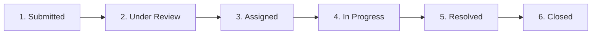

# 🎓 CampusResolve — College Complaint Management System

> **A centralized, web-based digital platform connecting students with college departments to report, track, and resolve campus issues efficiently.**

---

## 📌 Project Overview

**CampusResolve** transforms manual college grievance processes into a transparent, automated digital workflow. Students can submit complaints across multiple campus categories (Wi-Fi, Classrooms, Hostels, Laboratories, Cleanliness, Transportation, Infrastructure, Cafeteria, and Library), track real-time 6-stage lifecycle progress, communicate with resolvers, and rate resolutions upon completion.

College administrators and department staff can triage incoming reports, assign dedicated staff, manage priority and status, monitor SLA escalations, and review department-wise analytics.

---

## 🌟 Feature Checklist (Based on Specification)

### ⭐ Core / Must-Have Features
- [x] **User Authentication & Roles**: Student, Department Staff/Resolver, and College Administrator registration and login.
- [x] **Student Dashboard**: Real-time KPI counters, recent complaints overview, search and status filters.
- [x] **Complaint Submission**:
  - Structured issue title and detailed description.
  - Multi-category classification (Wi-Fi, Hostels, Labs, Classrooms, Cleanliness, Transport, Infrastructure, Cafeteria, Library, etc.).
  - Priority levels (*Low*, *Medium*, *High*, *Critical*).
  - Specific campus location with quick presets.
  - Image/File attachment upload with live thumbnail preview.
- [x] **6-Stage Visual Status Tracking**:
  - `Submitted` ➔ `Under Review` ➔ `Assigned` ➔ `In Progress` ➔ `Resolved` ➔ `Closed`
  - Visual step-by-step progress stepper with timestamps, actors, and remarks.
- [x] **Complaint Details Page / Modal**:
  - Full issue inspection, photo evidence, reporter details, and assigned department staff.
  - Discussion stream for student-staff communication.
  - Official resolution notes and corrective action summaries.
- [x] **Admin Command Desk**:
  - Multi-criteria filtering (Status, Department, Priority, Search, Sort).
  - Dual viewing modes: **Data Table View** and **Kanban Board View**.
  - Department and staff assignment module.
  - Status progression & SLA escalation alerts.
- [x] **Persistent Database Storage**: SQLite/JSON file-backed persistence with realistic seed data.
- [x] **Frontend–Backend REST API**: Complete CRUD integration with Express.js and React (Vite).

### 🚀 Bonus / Advanced Features
- [x] **Real-Time Notification Center**: Bell indicator with unread count and toast popups.
- [x] **Simulated Email Dispatcher**: Live HTML automated email logs sent to students and department leads.
- [x] **Admin Analytics Dashboard**: Department performance bars, category breakdown, average resolution time (hours), and SLA compliance.
- [x] **Student Post-Resolution Feedback**: Interactive 5-star rating system with written reviews.
- [x] **🤖 AI Auto-Categorize & Prioritize**: Intelligent assistant suggesting category and urgency from raw descriptions.
- [x] **🤖 AI Issue Polish & Summarize**: Generates clean, actionable problem summaries for technicians.
- [x] **🤖 Smart Duplicate Detection**: Warns students if an active open ticket already exists in the same location.
- [x] **Modern UI/UX Design System**: Responsive glassmorphism, glowing status badges, and smooth Dark / Light mode toggle.
- [x] **1-Click Demo Persona Switcher**: Instant switching between Student, Admin, and Staff test accounts.

---

## 👥 Demo Accounts (Ready to Test)

The system comes pre-seeded with realistic data and accounts:

| Role | Name | Email | Password | Details |
| :--- | :--- | :--- | :--- | :--- |
| **Student** | Alex Johnson | `student@college.edu` | `password123` | Roll No: CS-2024-042 |
| **Student** | Priya Sharma | `priya@college.edu` | `password123` | Roll No: EC-2024-118 |
| **Administrator** | Dean Martinez | `admin@college.edu` | `admin123` | Head of Campus Operations |
| **Staff (IT Lead)** | David Vance | `wifi.support@college.edu` | `staff123` | Senior Network Engineer |

> 💡 **Tip**: You can use the **1-Click Demo Switcher** in the top navigation bar or the Login dialog to switch personas immediately without typing credentials!

---

## 🛠️ Tech Stack & Architecture

- **Frontend**: React 18, Vite, Vanilla CSS Design System (Custom Variables, Glassmorphism, Dark/Light Themes), Lucide React Icons.
- **Backend**: Node.js, Express.js REST API, Multer (file uploads), CORS.
- **Data Layer**: File-based persistent JSON / SQLite storage (`server/data.json`).
- **Tooling**: Concurrently for single-command full-stack development.

---

## 🚀 Quick Start — Running Locally

### 1. Prerequisites
- **Node.js** (v18 or higher installed on your system)
- **npm** (v9 or higher)

Check your versions in terminal:
```bash
node -v
npm -v
```

---

### 2. Installation

Navigate to the project root directory:
```bash
cd "project folder1"
```

Install root dependencies (Express, Multer, Concurrently):
```bash
npm install
```

Install client dependencies:
```bash
cd client
npm install
cd ..
```

---

### 3. Start Development Server (Full-Stack)

Run both the Backend API server and Frontend Vite server concurrently with a single command:

```bash
npm run dev
```

This starts:
- 🌐 **Frontend Application**: [http://localhost:3000](http://localhost:3000)
- 🔌 **Backend REST API**: [http://localhost:5000](http://localhost:5000)

Open your web browser and navigate to **`http://localhost:3000`** to use the application.

---

### 4. Running Backend or Frontend Individually (Optional)

If you wish to run services in separate terminal windows:

**Terminal 1 — Backend Server:**
```bash
npm run server
# Runs Express on port 5000
```

**Terminal 2 — Frontend Client:**
```bash
npm run client
# Runs Vite dev server on port 3000
```

---

### 5. Production Build

To build the optimized production frontend bundle:
```bash
npm run build
```
Then start the production server:
```bash
npm start
```
The Express server will automatically serve the built client bundle from `client/dist`.

---

## 🔄 6-Stage Complaint Lifecycle Workflow



1. **Submitted**: Student logs the complaint with location, description, and optional photo.
2. **Under Review**: Administrator triages the issue, verifies priority, and checks for duplicates.
3. **Assigned**: Admin assigns the ticket to a campus department (e.g. IT, Hostel, Infrastructure) and staff member.
4. **In Progress**: Department technician begins repair/servicing and posts discussion updates.
5. **Resolved**: Staff marks the issue as resolved with formal action remarks.
6. **Closed**: Student tests the fix, submits a 5-star resolution rating and review, closing the ticket.

---

## 📡 REST API Reference

### Authentication
- `POST /api/auth/login` — Sign in with email and password.
- `POST /api/auth/register` — Create a new student/staff/admin account.
- `GET /api/auth/users?role={role}` — List system users filtered by role.
- `GET /api/auth/departments` — List campus maintenance departments.

### Complaints
- `GET /api/complaints` — Retrieve complaints (supports `search`, `status`, `category`, `priority`, `department`, `studentId`, `sortBy`).
- `GET /api/complaints/:id` — Retrieve full complaint details including timeline and comments.
- `POST /api/complaints` — Create a new complaint (supports `multipart/form-data` with photo attachment).
- `PATCH /api/complaints/:id/status` — Update complaint status with admin remarks.
- `PATCH /api/complaints/:id/assign` — Assign department and resolver staff.
- `PATCH /api/complaints/:id/priority` — Change priority level (*Low*, *Medium*, *High*, *Critical*).
- `POST /api/complaints/:id/comments` — Post a message to the complaint discussion thread.
- `POST /api/complaints/:id/feedback` — Submit student 1–5 star rating and review.
- `DELETE /api/complaints/:id` — Remove complaint record.

### Analytics & AI
- `GET /api/analytics` — Fetch KPI statistics, department breakdown, category distribution, and average resolution time.
- `POST /api/ai/categorize` — AI smart category and priority detection.
- `POST /api/ai/summarize` — AI issue summarizer and formatter.
- `POST /api/ai/check-duplicates` — Duplicate open ticket similarity detector.

### Notifications & Email Logs
- `GET /api/notifications?userId={id}` — Retrieve user notifications.
- `PATCH /api/notifications/:id/read` — Mark a notification as read.
- `POST /api/notifications/mark-all-read` — Mark all notifications as read.
- `GET /api/notifications/emails` — View simulated automated email transmission logs.

---

## 📂 Project Directory Structure

```
project folder1/
├── package.json               # Root scripts (dev, server, client, build, start)
├── README.md                  # Detailed local setup and user guide
├── spec.md                    # Project requirements specification
├── server/
│   ├── index.js               # Express API entry point & static server
│   ├── db.js                  # Database storage helper & pre-seeded dataset
│   ├── data.json              # Persistent database file
│   ├── uploads/               # Uploaded complaint photo attachments
│   └── routes/
│       ├── auth.js            # User authentication & department routes
│       ├── complaints.js      # Complaint CRUD, status, assign, rating routes
│       ├── analytics.js       # Admin KPIs & department performance metrics
│       ├── ai.js              # AI categorization, summarizer & duplicate check
│       └── notifications.js   # Real-time notifications & email simulator logs
└── client/
    ├── index.html             # HTML entry with Google typography
    ├── vite.config.js         # Vite configuration with API proxy
    ├── package.json           # Frontend dependencies
    └── src/
        ├── main.jsx           # React app mount
        ├── App.jsx            # Portal routing & modal coordinator
        ├── index.css          # Vanilla CSS Design System (Dark/Light themes)
        ├── context/
        │   ├── AuthContext.jsx         # Auth state & 1-click demo switcher
        │   └── NotificationContext.jsx # Toast alerts & live notification polling
        ├── components/
        │   ├── Navbar.jsx              # Header, tabs, notification center, theme
        │   ├── StudentDashboard.jsx    # Student KPIs, search, complaint cards
        │   ├── AdminDashboard.jsx      # Admin table/kanban, department assign
        │   ├── AnalyticsDashboard.jsx  # Visual department & SLA analytics
        │   ├── SubmitComplaintModal.jsx# AI-assisted submission with photo upload
        │   ├── ComplaintDetailsModal.jsx# 6-stage timeline, comments, feedback
        │   ├── EmailSimulatorModal.jsx # Simulated email viewer
        │   ├── AuthModal.jsx           # Login & Registration dialog
        │   └── StarRating.jsx          # Interactive 5-star rating component
        └── utils/
            └── api.js                  # Fetch wrapper for REST endpoints
```

---

## 📄 License
This project is licensed under the MIT License.
